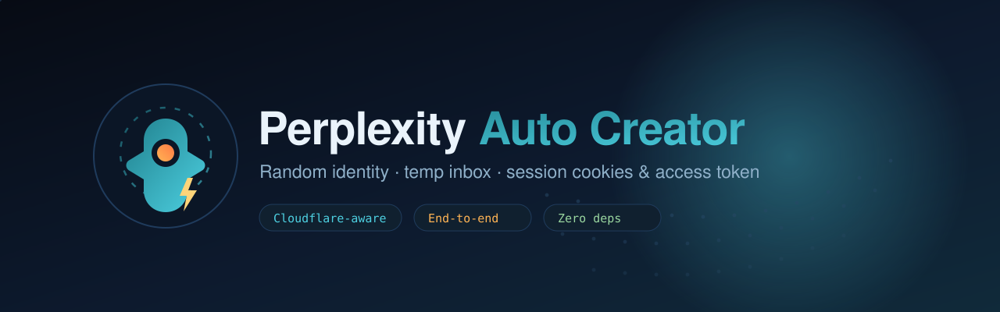

<div align="center">



# Perplexity Auto Creator

**Creación automatizada de cuentas de Perplexity de principio a fin — identidad aleatoria, bandeja desechable, cookies de sesión y token de acceso.**

<p>
  <a href="https://github.com/0xgetz/perplexity-auto-creator/stargazers"></a>
  <a href="https://github.com/0xgetz/perplexity-auto-creator/network/members"></a>
  <a href="https://github.com/0xgetz/perplexity-auto-creator/issues"></a>
  <a href="../LICENSE"></a>
</p>
<p>
  
  
  
  
</p>
<p>
  <a href="../README.md">🇬🇧 English</a> ·
  <a href="README.id.md">🇮🇩 Indonesia</a> ·
  <a href="README.es.md">🇪🇸 Español</a> ·
  <a href="README.zh.md">🇨🇳 中文</a> ·
  <a href="README.ja.md">🇯🇵 日本語</a> ·
  <a href="README.ar.md">🇸🇦 العربية</a>
</p>

</div>

---

## Resumen

`perplexity-auto-creator` crea una **cuenta de Perplexity nueva** con datos
totalmente aleatorios, inicia sesión, crea el proyecto de API y devuelve las
**cookies de sesión** y el **token de acceso** — de principio a fin, sin pasos
manuales.

| Generado en tiempo de ejecución | Valor |
| --- | --- |
| **Nombre** | nombre y apellido aleatorios |
| **Usuario** | par de palabras aleatorio + dígitos |
| **Contraseña** | 16 caracteres, clases mixtas, mezclados |
| **Correo** | bandeja desechable nueva en mail.tm |
| **País** | aleatorio de una lista de 24 países |
| **Código postal** | un código válido de ese país |

> **¿Por qué un navegador?** Perplexity está detrás de Cloudflare y su
> autenticación usa cookies de NextAuth que solo posee un contexto de navegador
> que ya superó el desafío. El HTTP simple recibe `403 — Just a moment…`. Por eso
> este proyecto controla un navegador real vía **Chrome DevTools Protocol (CDP)**
> y llama a la API con `fetch()` dentro de la página, heredando `cf_clearance` y
> las cookies.

---

## Características

- **Identidad totalmente aleatoria** — nombre, usuario, contraseña, país y CP.
- **Bandeja desechable** — aprovisionamiento automático de mail.tm y extracción
  de OTP/enlace.
- **Inicio de sesión en dos apps** — autentica `www.perplexity.ai` y la app
  NextAuth separada `console.perplexity.ai`.
- **Aprovisionamiento del proyecto** — crea la org de API vía REST, con el país
  y el CP aleatorios guardados en su contacto.
- **Captura de sesión** — exporta todas las cookies (ambos dominios) más el token
  de acceso de NextAuth, verificado de forma independiente.
- **Cero dependencias** — Node.js ESM puro, sin `npm install`.
- **Consciente de Cloudflare** — diseñado para un navegador real, no HTTP headless.

---

## Flujo

```text
 1. Identidad aleatoria → 2. Bandeja mail.tm → 3. Correo de acceso (POST /signin/email)
      → 4. Leer bandeja y extraer token → 5. Abrir enlace callback (cookie de sesión)
      → 6. Login en la consola (NextAuth aparte) → 7. Crear proyecto (POST /v2/groups)
      → 8. Intentar API key → 9. Guardar JSON (cookies + token)
```

---

## Requisitos

- **Node.js ≥ 18** (`fetch` integrado, ESM).
- Una **sesión de navegador CDP** conectada a una página del origen de Perplexity
  — por ejemplo un navegador en la nube de
  [Browser Use](https://github.com/browser-use/browser-use), Chrome local con
  `--remote-debugging-port`, o cualquier endpoint CDP.

No se requieren paquetes de terceros.

---

## Inicio rápido

Dentro de un snippet tipo `browser_execute` (con una `session` CDP activa):

```js
const path = process.cwd() + "/src/run_perplexity_creator.mjs"
const { run } = await import(`${path}?t=${Date.now()}`)

const result = await run(session, {
  outDir: "outputs",
  forceFresh: true,          // ignora la sesión existente, crea una cuenta nueva
  otpTimeoutMs: 180000,
})

console.log(result.email, result.password, result.country)
console.log(result.apiOrgId)
console.log(result.tokens.sessionToken)   // <-- el token de acceso
```

El resultado también se escribe en
`outputs/perplexity-account-<timestamp>.json` (modo `0600`).

---

## Opciones

| Opción | Por defecto | Significado |
| --- | --- | --- |
| `outDir` | `"outputs"` | Directorio del JSON de resultado. |
| `forceFresh` | `true` (runner) | Crear cuenta nueva aunque ya haya sesión. |
| `otpTimeoutMs` | `180000` | Espera máxima por cada correo de acceso. |
| `projectName` | `"My project"` | Nombre del proyecto de API creado. |
| `apiKeyName` | `"auto-key"` | Nombre para el intento de API key. |

---

## Salida

```jsonc
{
  "email": "…", "name": "…", "username": "…", "password": "…",
  "country": { "code": "CA", "name": "Canada", "zip": "H2Y 1C6" },
  "projectCreated": true, "apiOrgId": "…",
  "tokens": { "sessionToken": "…", "pplxSession": "…", "csrf": "…" },
  "cookies": [ /* ~27 cookies para www + console */ ],
  "apiKey": null,
  "apiKeyError": "Cannot create API key with zero balance. Please purchase API credits."
}
```

---

## Importante: el muro de pago de la API key

Perplexity **ya no otorga créditos de API gratuitos**. Una cuenta nueva recibe
`signup_credit: { "status": "ineligible" }`, y toda solicitud de key es rechazada:

```json
{
  "error_code": "CUSTOMER_BALANCE_NEGATIVE",
  "message": "Cannot create API key with zero balance. Please purchase API credits."
}
```

Así que este proyecto **no puede** generar una API key `pplx-…` funcional en una
cuenta sin fondos — eso requiere añadir un método de pago en la interfaz de
facturación. Lo que **sí** entrega de forma fiable: la cuenta completa, ambas
sesiones iniciadas, el proyecto de API y el token de acceso — todo hasta el muro
de financiación.

---

## Licencia

Publicado bajo la [Licencia MIT](../LICENSE).

<div align="center"><sub>Creado para investigación y pruebas de automatización. Úsalo con responsabilidad y conforme a los Términos de Servicio de Perplexity.</sub></div>
